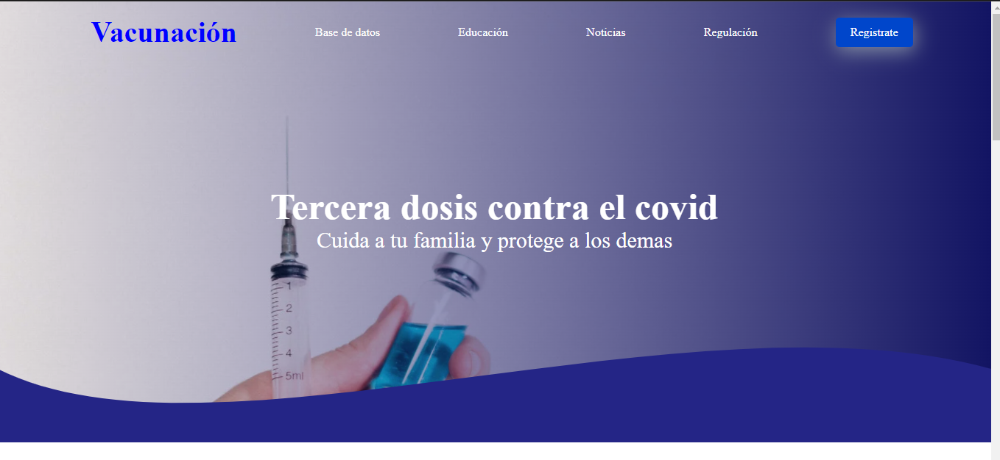
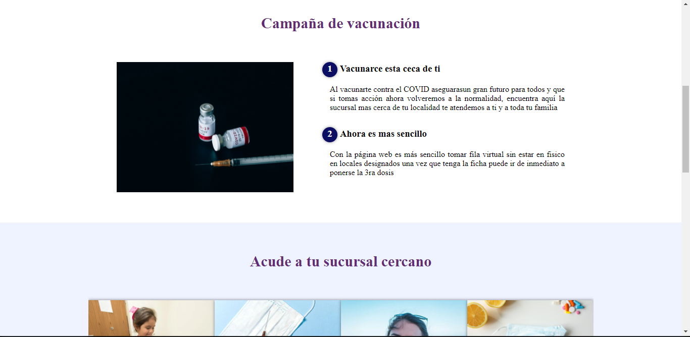
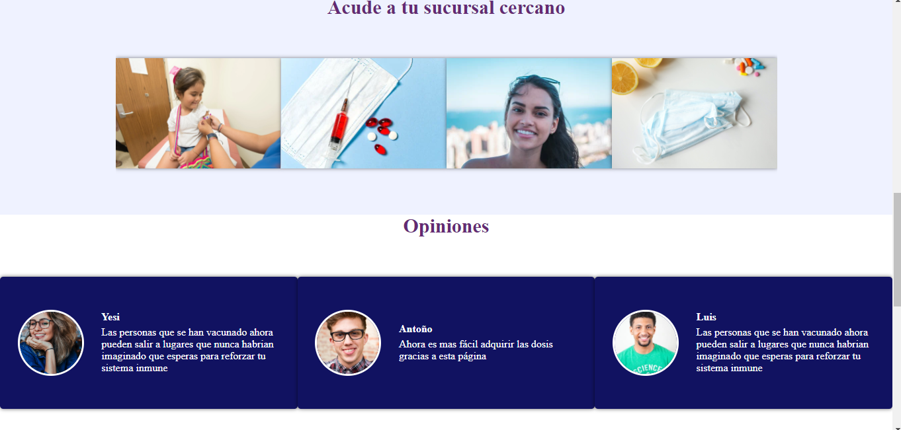
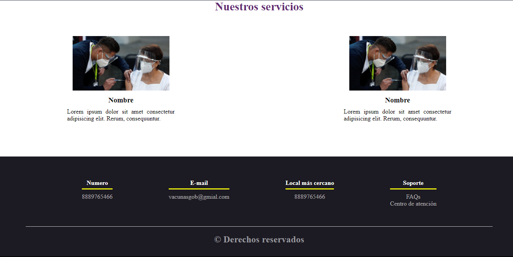
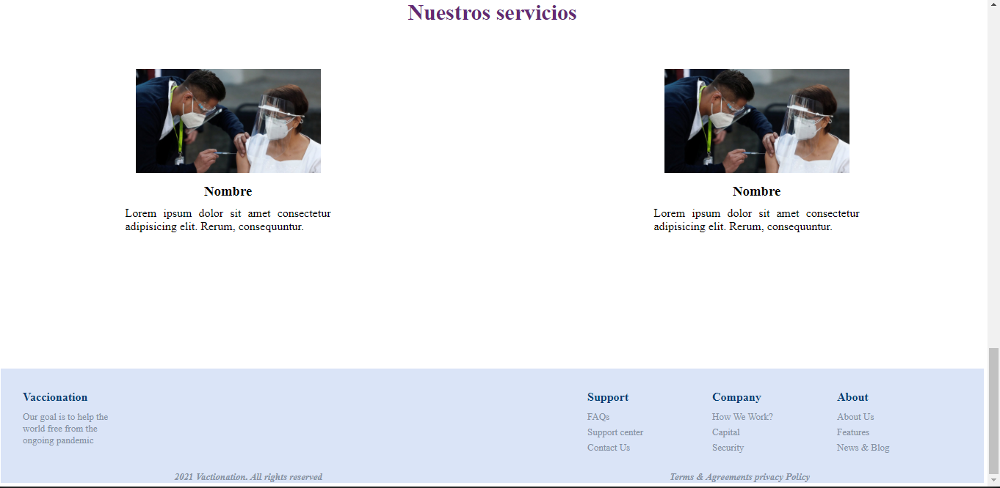

## Práctica CSS

Clonar la página
Creacion de campaña publicitaria
<a href="planes%20%marketing">Campaña Publicitaria <a>

Creacion de pagina a travez de html
y diseño con CSS 

Esto es lo que pude hacer por ahora luego actualizaré para meter más paginas

*Pagina creada*  
 
 
 
 
 

