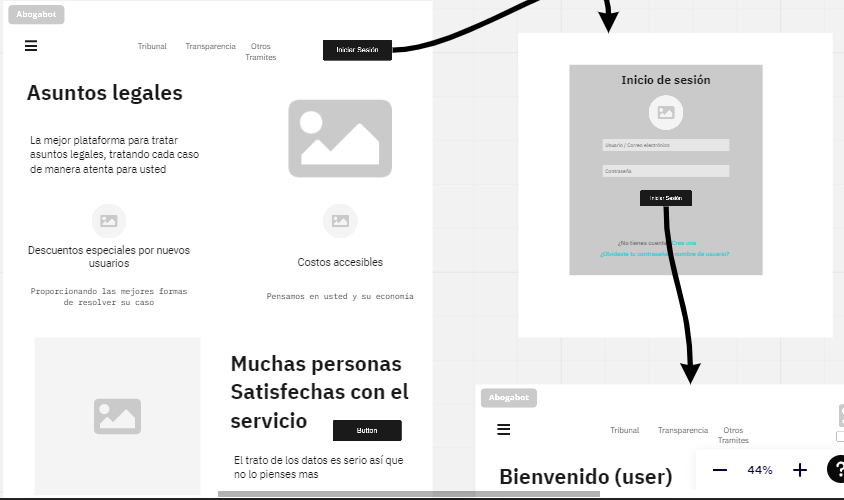
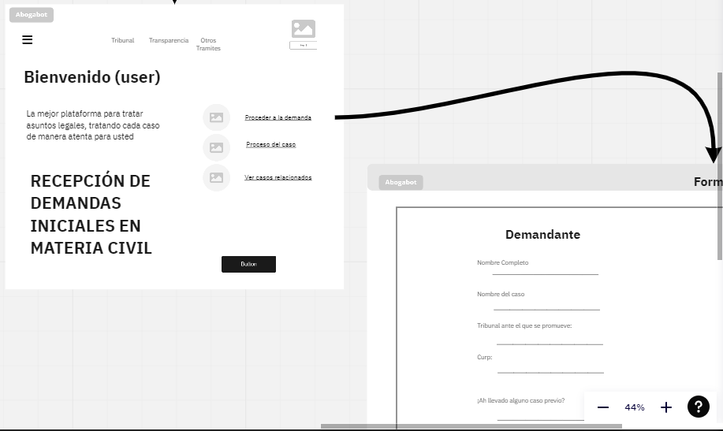
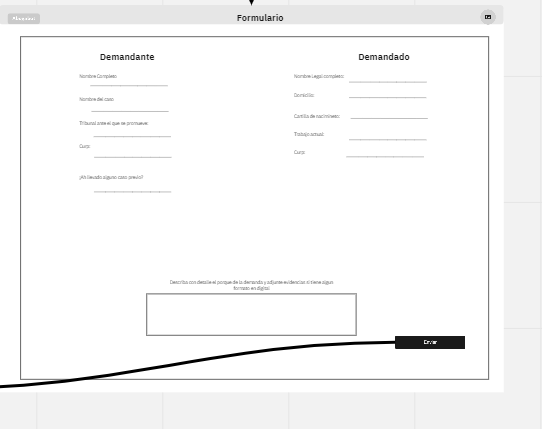
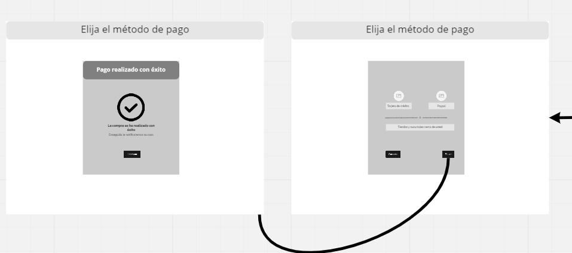

# Abogabot
**Requerimientos**

Es un despacho de abogados que quiere automatizar las demandas de sus clientes Al momento de llenar el formulario se manda al proceso de pago para finalizar la transacción. Para dar seguimiento a su demanda, el cliente crea una cuenta en la plataforma y verá el seguimiento de cada una de las actualizaciones del proceso legal.
El administrador del sitio recbe la notificación de una nueva demanda y con los datos llenados del formulario se crea automaticamente el documento legal en formato word para empezar el proceso.
El administrador recibe el pago y debe de ser capaz de verlo en un dashboard para ver la cantidad de ingresos recibidos.
El administrador actualiza el proceso de la demanda y agrega comentarios en cada paso del proceso.
Al usuario le llegan correos de notificación para saber el avance de su proceso.
La página debe de ser responsive para poderla ver desde el celular.
La preferencia de colores del cliente es azul marino y blanco, pero acepta propuestas.

## Practicas

Todas las practicas de la primera semana hechas en este apartado se muestra de forma visual.

Proyectos hechos con miro:

https://miro.com/app/board/uXjVOJUaJmc=/

https://miro.com/app/board/uXjVOJZicm0=/

https://miro.com/app/board/uXjVOIqAd_I=/

## -Toma de requerimientos
Toma de requerimientos necesarios para para estructurar el programa de modo que se facil de entender.

 [ Aquí la toma de requerimientos](./Requerimientos.doc)

## -Buyer persona
Es importante conocer a un usuario en especifico para conocer más a detalle de como es la vida cotidiana para
ello tomar un modelo y generar un publico objetivo.

[Aquí buyer persona](./Buyer%20Persona%20.pdf)
    
## -Publico objetivo
Una vez teniendo el pueblico objetivo podemos ofrecer los servicios a publico que le interese y a mas personas
con las mismas caracteristicas.

     
    
    
## Wireframe UX
El modelo que representa como estará estructurado los botones, inicio de sesión entre otros para que la pagina o aplicación
no tenga ningun incoveniente.

 

## UI
La parte de diseño color imagen para que nuestra pagina no sea tan aburrido y tenga una estetica agradable para el usuario.

